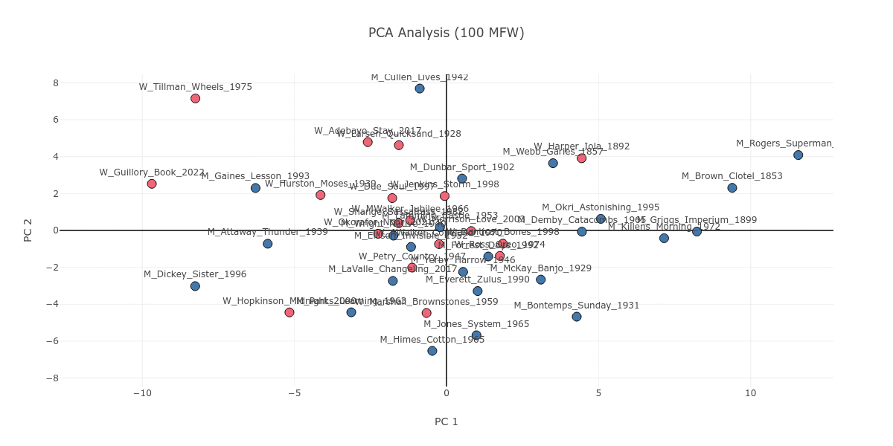
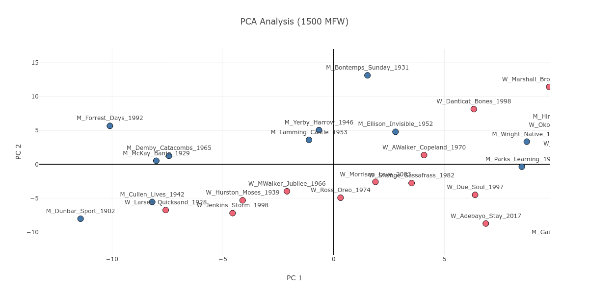
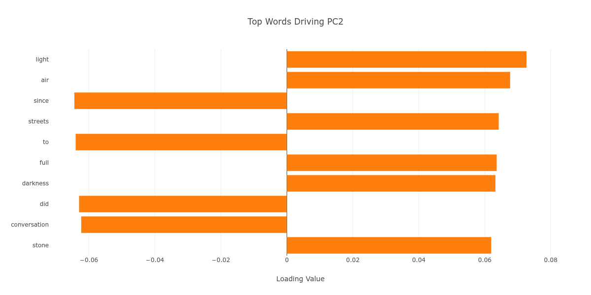
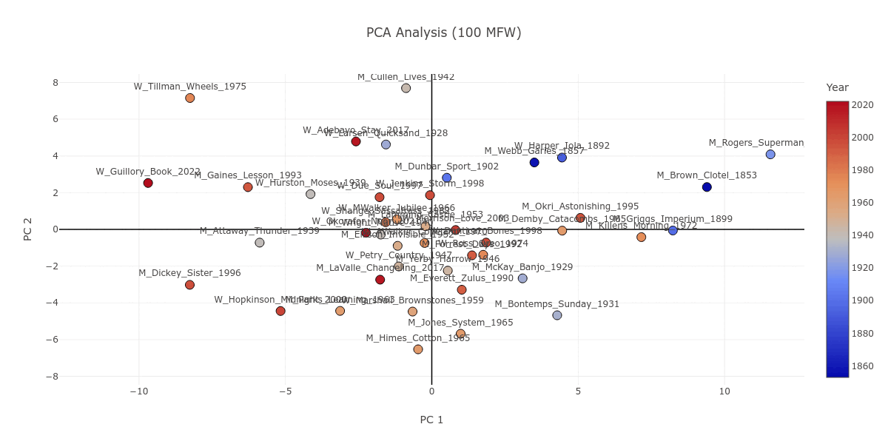

* TOC
{:toc}

# 42 Books / 42 Years Blog Post 1: Stylometric Analysis
> Access the Stylometric Analysis Explorer, the companion piece to this blog, [here.](SAE.html)

## Introduction: what is stylometric analysis, anyway?
I would like to begin my series of blog posts on the books comprising [History of Black Writing (HBW)](https://hbw.iu.edu)'s 2025 exhibit [*42 Books / 42 Years*](https://hbw.iu.edu/news-events/events/42Books-42Years/index.html), with a distant[^1] stylometric reading. "Stylometry," in this context, is the statistical analysis of linguistic style in texts. Stylometry has a long history; in a foundational article dating to 1887, T. C. Mendenhall considers the word-length distribution of texts as a vector of their authors' unconscious stylistic fingerprints.[^2]

Following Mendenhall, many contemporary stylometric studies have the objective of attributing an author to documents of disputed or unknown authorship. As a case in point, in 2013, Duquesne University computer scientist Patrick Juola found evidence suggesting that J. K. Rowling wrote the detective novel *The Cuckoo's Calling* under the pseudonym Robert Galbraith.[^3] Among other measures, Juola selected the 100 most frequent words (more on this [below!](#what-i-did-how-i-did-it-and-what-it-all-means)) occurring in a corpus of texts by a handful of authors, and compared the ratio of these words in *The Cuckoo's Calling* with the texts in the corpus.

In comparison to such studies as Mendenhall's and Juola's, this blog post aims to discover what we can learn from the stylistic (dis)similarities among the books in HBW's *42 Books / 42 Years* corpus. Such an employment of stylometric methods is indeed a cornerstone of computational literary studies scholarship.[^4]

## Methodology
### What I did, how I did it, and what it all means
Since this is a blog post, and not a full-fledged scholarly article, I will not bore you with the details of how I preprocessed the 42 novels, or the mathematical nuances of how I converted the novels into normalized frequency distributions. Still, I should briefly explain what I did, and how I did it.

First, I placed each novel into a consistent naming schema, such that—for instance—Nella Larsen's *Quicksand* was identified as W_Larsen_Quicksand_1928, and Paul Laurence Dunbar's *The Sport of the Gods*, as M_Dunbar_Sport_1902. M/W indicate the authors' genders. This naming schema not only facilitates the visual separation of the novels based on their publication dates and their authors' genders, but also makes gender/publication date information visible on the screen all the time without cluttering the plots.

Next, I used the Python natural language processing (NLP) library [spaCy](https://spacy.io/) to break each novel into individual tokens (or, in common parlance, words). I then converted each text into frequency distributions of the *n* most frequent words (MFWs) in the corpus, starting from 100 MFWs and ending at 2000, in increments of 100. I did this twice, once including stopwords, and once excluding them. "Stopwords," an NLP term of art, refers to words with low semantic value and high frequency, such as pronouns and prepositions. They are generally not filtered out in stylometric analyses, since such words give insight into the unconscious stylistic fingerprints of authors. Still, filtering them out may have interesting implications.

Finally, I:

1. Calculated, for each novel, what percentage of the total text each word represents.
    
2. Normalized these percentages in view of the entire corpus: if 5.4% of *The Sport of the Gods* is "the," and if the average percentage value of "the" is lower than 5.4%, then "the" gets a positive "z-score" value. (It would get a negative z-score if the percentages were reversed.)[^5]

Z-score normalization is necessary in this task, because it equalizes the weight of every single word in a given MFW stratum. If I were to use raw percentages, then words with very high frequency would give no room for other words to influence the results in any of the MFW strata.

In sum, I converted the novels to normalized frequency distributions that measure how differently a novel is written from the rest in terms of word frequency. It is important to note here that, when we look at lower frequency strata like 100 MFW (remember [Juola](#introduction-what-is-stylometric-analysis-anyway)?), we look almost exclusively at words with low semantic value. Words such as "the," "to," or "I" are bound to dominate every English text, frequency wise. This will give us information on the unconscious style of texts. In comparison, when we look at higher MFW strata, we are looking at the content of texts along with their unconscious style. As we will see below, this has interesting implications with regard to gender, chronology, as well as embodiment.[^6]

### The matter of visualization
This subsection serves as a quick overview of the five visualization components of the Stylometric Analysis Explorer. I will rely primarily on the first of these components in this blog post.
1. **Principal Component Analysis (PCA) Plot:** In short, a PCA plot puts our normalized frequency distributions on a two-dimensional plane. Think of it this way: a frequency distribution of 100 MFWs is a 100-dimensional shape, which is hard to visualize. PCA reduces those dimensions to two "principal components" (PCs). On this PCA plot, our 42 novels can be separated on the basis of gender and publication date.
2. **Distinctive Words (Top 5 -/+):** Displays the five most extreme negative and positive z-scores for each novel. This can show what words make a given novel different from the rest.
3. **Loadings (Top 10):** Displays the top 10 loadings for PC1 and PC2. A positive loading for a word means that the presence of this word contributes to the PC, whereas a negative loading means that the word's absence contributes to the PC.
4. **Cluster Analysis:** Calculates the distance between each novel pair using Manhattan distance, and clusters the novels according to these pairwise distances using Ward's method into a dendrogram (tree graph).
5. **Distance Heatmap:** Puts the pairwise distances between each novel on to a heatmap.

## Analysis
### Looking from afar: gender and chronology

Well, let's get right into it. Let's look at our data from afar, and look at the broad divisions of gender and chronology. As [Figure 1](#Figure1) shows, on lower MFW strata, there is not much difference between authors of different genders; everyone's novel groups around the center of the plot. As the plot moves to the higher MFW strata, a slight division of genders starts to emerge in the center.

{: #Figure1}
>Figure 1. The PCA plot as it progresses from 100 to 2000 MFW, with the novels color coded as pink or blue based on their authors' genders.

On its face, this could suggest that men and women write about different things, as higher MFW strata include content-based information. It occurs to me that this gender division is not purely based on content in the sense of genre or theme. Let's zoom in on the main manifestation of this division on the high MFW stratum of 1500. We can find corresponding books along the gender division in [Figure 2](#Figure2): The New Orleans romance of Frank Yerby's *The Foxes of Harrow* (M_Yerby_Harrow_1946) can pair with the passionate historical romance of Beverly Jenkins's *Through the Storm* (W_Jenkins_Storm_1998); likewise, we can associate the psychological studies of Nella Larsen's *Quicksand* (W_Larsen_Quicksand_1928) and Ralph Ellison *Invisible Man* (M_Ellison_Invisible_1952).

{: #Figure2}
>Figure 2. The PCA plot, zoomed in on the 1500 MFW stratum.

The problem is that these two pairs aren't associated, at least not on the plot. Why? The gender division could parallel the division of externality and internality. Yerby's novel moves between New Orleans and the nearby Harrow plantation; even the title suggests an emphasis on setting (and, hence, on externality). In contrast, *Quicksand*, despite the cosmopolitan reach of its setting from America to Europe, has a suffocating and claustrophobic feel—I am thinking, in particular, of how Helga is trapped by the biological process of childbirth at the end of the novel. [Figure 3](#Figure3) gives credence to my hypothesis; the PC2 axis where the division occurs seems driven in large part by words of the outside world, such as "light," "air," "streets," and "darkness."

{: #Figure3}
>Figure 3. The top ten loadings of PC2 on the 1500 MFW stratum.

Looking at [Figure 1](#Figure1), one may notice *Iola Leroy, or, Shadows Uplifted* by Frances E. W. Harper (W_Harper_Iola_1892) as a text which, in contrast to the gender division discussed above, is consistently grouped together with novels written by men. If we stop to look with more attention, we can see that *Iola Leroy* is in fact grouped together with nineteenth-century novels like itself. [Figure 4](#Figure4) attests to this observation; starting from 100 MFW all the way to the 2000 MFW stratum, nineteenth- and early-twentieth-century novels are largely grouped together. *Iola Leroy* is surrounded with books by male authors simply as a corollary of the sizable temporal gap between itself and the other women-written novels in our corpus, with the 1928 *Quicksand* being the next earliest.

{: #Figure4}
>Figure 4. The PCA plot as it progresses from 100 to 2000 MFW, with the novels color coded in a gradient from blue to red based on their publication dates.

As [Figure 5](#Figure5) shows, the PC1 axis, which is the main vehicle of the chronological division among our 42 novels, seems to be driven by low semantic value, high frequency words that we associate with unconscious style regardless of the MFW stratum. It may be said, then, that the chronological style drift over time observed in this plot has its roots in how Black authors of different periods have approached the English language.

{: #Figure5}
>Figure 5. The top ten loadings of PC1, in a progression from 100 to 2000 MFW.

500...

[^1]: "Distant" as in digital humanities pioneer Franco Moretti's famous coinage, "distant reading." I mean to say that I will apply computational methodology to look at all 42 books at once, instead of close reading a few of them.
[^2]: Mendenhall, T. C. ["The Characteristic Curves of Composition."](https://www.jstor.org/stable/1764604) *Science*, vol. 9, no. 214, 1887, pp. 237–49.
[^3]: See [this](https://languagelog.ldc.upenn.edu/nll/?p=5315) *Language Log* blog post.
[^4]: As just two examples of this kind of computational literary studies scholarship, see Matthew L. Jockers's [*Macroanalysis: Digital Methods and Literary History*](https://www.press.uillinois.edu/books/?id=p079078) (2013) and Andrew Piper's [*Enumerations: Data and Literary Study*](https://press.uchicago.edu/ucp/books/book/chicago/E/bo28465405.html) (2018).
[^5]: This is a very simplified explanation of the z-score normalization procedure, and misses important nuances. For a more detailed explanation, which comes complete with Python code, please read the section on John Burrows's Delta method in François Dominic Laramée's *Programming Historian* tutorial, ["Introduction to stylometry with Python"](https://programminghistorian.org/en/lessons/introduction-to-stylometry-with-python#third-stylometric-test-john-burrows-delta-method-advanced).
[^6]: Readers familiar with the field of stylometry will notice that this is the underlying logic of John Burrows's Delta method. See Burrows, John. ["'Delta': A Measure of Stylistic Difference and a Guide to Likely Authorship."](https://doi.org/10.1093/llc/17.3.267) *Literary and Linguistic Computing*, vol. 17, no. 3, Sep. 2002, pp. 267–87.
